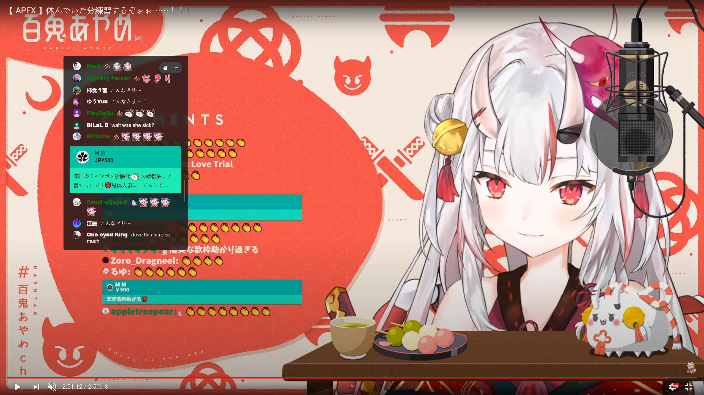
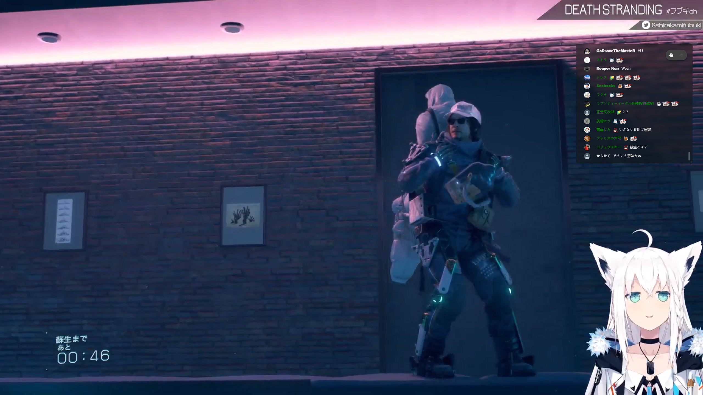

# Youtube-Chat-in-Fullscreen
A chrome extension creates an overlay to show Youtube live chat when in full screen

## Key Features

- Show a live chat overlay when you are watching Youtube live stream in full screen
- Support video pages with chat replay
- Move and resize the overlay as you want
- Adjustable font size and background opacity

## Usages

- Use `Ctrl+alt+c` to toggle overlay
- Press and hold `Ctrl`, then drag to move the position of overlay

## Known issue

- Unable to catch first chat request after the page loaded
- When you holding resize for long time, the overlay may suddenly move its position

 *If you have and issues and suggestions please feel free to create a issue.*

## Screenshot

*Chat overlay on Youtube Live Replay*

*Chat overlay on Youtube Live*

