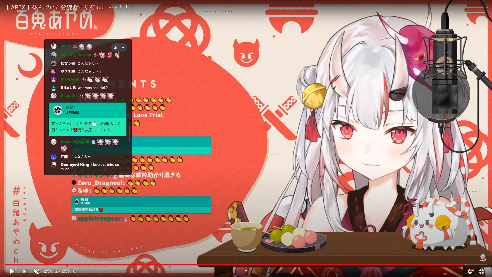
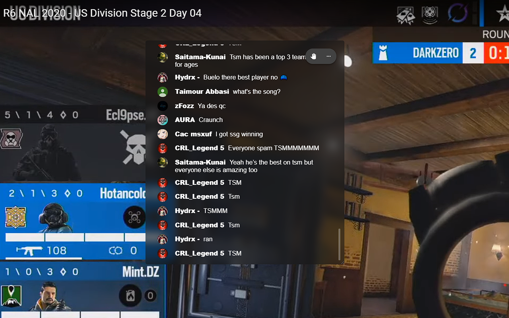
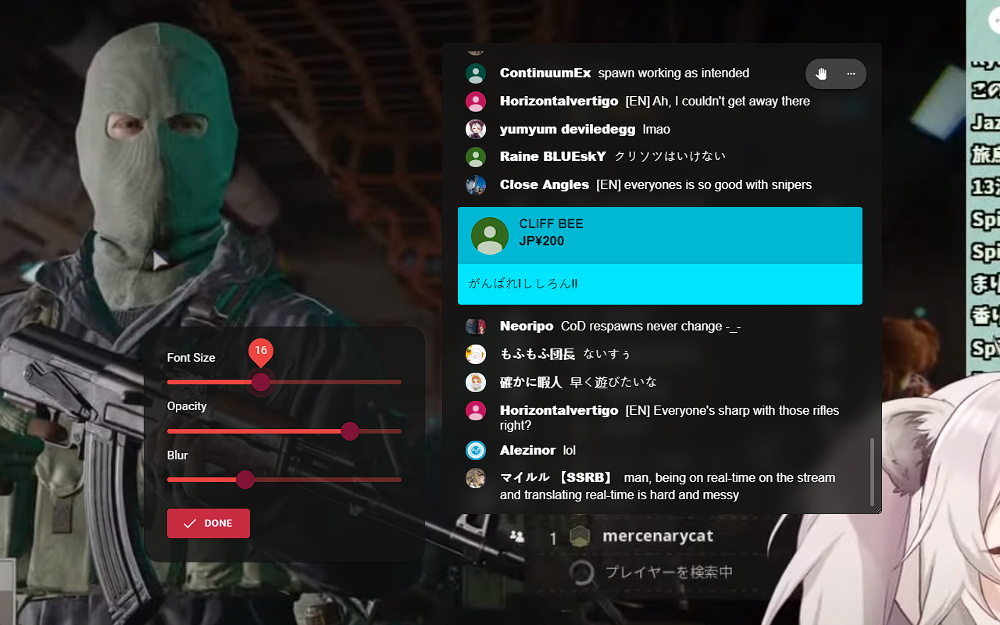

# Youtube-Chat-in-Fullscreen

A chrome extension creates an overlay to show Youtube live chat when in full screen

## Key Features

- Show a live chat overlay when you are watching Youtube live stream in full screen
- Also support video pages with chat replay
- You can adjust position, opacity, size, and font size of the overlay as you wish

## Usages

- Use `Ctrl+Alt+c` to toggle overlay
- Press and hold `Ctrl+Alt`, then drag to move the position of overlay

## Known issue

- Unable to catch first chat request after the page loaded (maybe the first live chat request come before the page is loaded)
- Freeze when go from a live page to a none-live-page
- chats queue are not clear

 *If you have any issues and suggestions please feel free to create a issue.*

## Update

v1.0.0.2

- Able to stop auto scroll down by scroll up
- Much clear instructions on settings panel
- Settings of overlay do not sync between device any more (prevent settings conflict)

v1.0.0.3 `4-Oct-2020`

- Fixed auto scroll bug

v1.0.0.4 `7-Oct-2020`

- Fixed unpredictable resizing issue
- scroll to bottom when re-enter full screen mode (If auto scroll is still enable)

v1.0.0.5 `8-Oct-2020`

- Fixed auto scroll bugs when re-enter full screen mode 

v1.0.0.6 `12-Oct-2020`

- Fixed the authentication request issue when using brand account
- Fixed the problem that the chat overlay is still showing unrelated chat and visible when navigate video page

v1.0.0.7 `23-Oct-2020`

- Show initial chat records in chat box
- Fixed the freezing issue when go from a live streaming page to a normal video page 
- 

## Screenshot

*Chat overlay on Youtube Live Replay*

*Chat overlay on Youtube Live*

*Settings Panel*

## License

<a href="/LICENSE">GNU General Public License v3.0</a>
